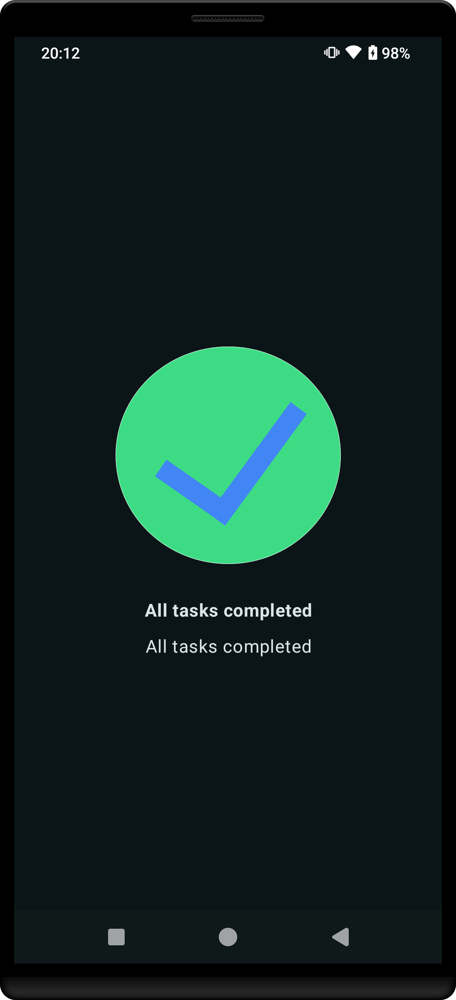

# Android Kotlin Bootcamp Apps Collection

This repository contains a collection of Android applications developed while following Google's Kotlin Bootcamp for Programmers. Each directory contains the source code for an individual project along with a screenshot of the application.

## Applications

<table>
  <tr>
    <td>
      
      
Birthday Card

      <ul>
        <li><a href="birthday_card">Source Code</a></li>
        <li><a href="https://github.com/SoaresPT/AndroidBasics/releases/tag/birthdaycard">Latest Release</a></li>
      </ul>
    </td>
    <td>
      
      
Business Card

      <ul>
        <li><a href="business_card">Source Code</a></li>
        <li><a href="https://github.com/SoaresPT/AndroidBasics/releases/tag/BusinessCard">Latest Release</a></li>
      </ul>
    </td>
    <td>
      
      
Calculate Tip App

      <ul>
        <li><a href="calculate_tip_app">Source Code</a></li>
        <li><a href="https://github.com/SoaresPT/AndroidBasics/releases/tag/CalcuateTip">Latest Release</a></li>
      </ul>
    </td>
  </tr>
  <tr>
    <td>
      
      
Composable Basics 2

      <ul>
        <li><a href="composable_basics_2">Source Code</a></li>
        <li><a href="https://github.com/SoaresPT/AndroidBasics/releases/tag/ComposableBasics2">Latest Release</a></li>
      </ul>
    </td>
    <td>
      
      
Dice Roller

      <ul>
        <li><a href="dice_roller">Source Code</a></li>
        <li><a href="https://github.com/SoaresPT/AndroidBasics/releases/tag/DiceRoller">Latest Release</a></li>
      </ul>
    </td>
    <td>
      
      
Jetpack Compose Tutorial

      <ul>
        <li><a href="jetpack_compose_tutorial">Source Code</a></li>
        <li><a href="https://github.com/SoaresPT/AndroidBasics/releases/tag/ComposableBasics1">Latest Release</a></li>
      </ul>
    </td>
  </tr>
  <tr>
    <td>
      
      
Lemonade App

      <ul>
        <li><a href="lemonade_app">Source Code</a></li>
        <li><a href="https://github.com/SoaresPT/AndroidBasics/releases/tag/Lemonade">Latest Release</a></li>
      </ul>
    </td>
  </tr>
</table>

## About
This collection of apps is part of the Google Kotlin Bootcamp for Programmers, meant to help learn the essential skills around Kotlin and Android development.

## How to Build
1. Clone this repository.
2. Open the desired project directory in Android Studio.
3. Build and run the application on your Android device or emulator.
