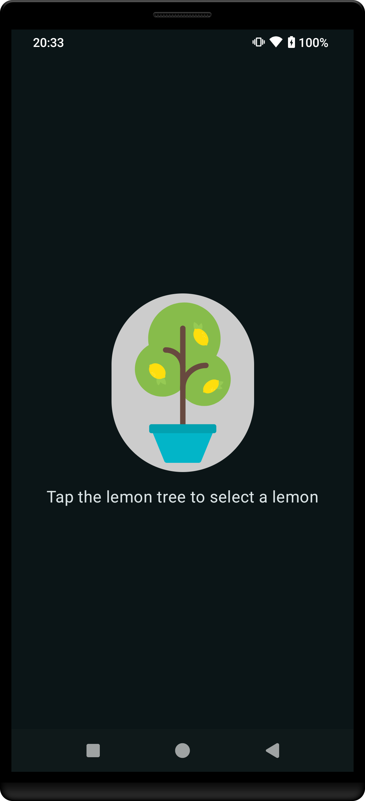

# Lemonade App 

Lemonade App demo from https://developer.android.com/ kotlin bootcamp.

## Screenshot

<figure>
  
  <figcaption>Screenshot of Lemonade App</figcaption>
</figure>

## Download
1. **Download the App**: Download the app from the [Releases tab](https://github.com/SoaresPT/AndroidBasics/releases/tag/Lemonade)